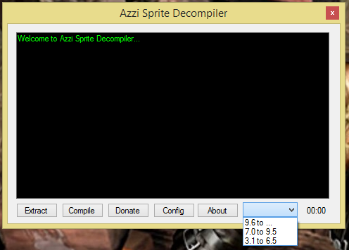

# Azzi Sprite Compiler V2
Da série "coisas que desenvolvi quando participava das comunidade de Open Tibia entre 2007 e 2010"

Transforma o arquivo SPR do tibia em imagens editáveis, e consegue reescrever o arquivo SPR depois
de alterações das sprites.

A diferença do V1 pro V2 é que o V1 usa um timer que a cada uma certa
quantidade de milisegundos descompressa uma certa quantidade de sprites, enquanto o V2 se manter em 
um while gigantesco de descompressão que é jogado para uma outra thread de processamento, impedindo
que a tela do sistema trave enquanto a leitura ou escrita é feita.

